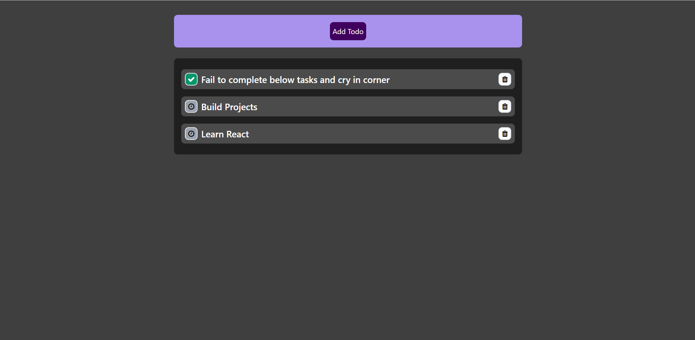
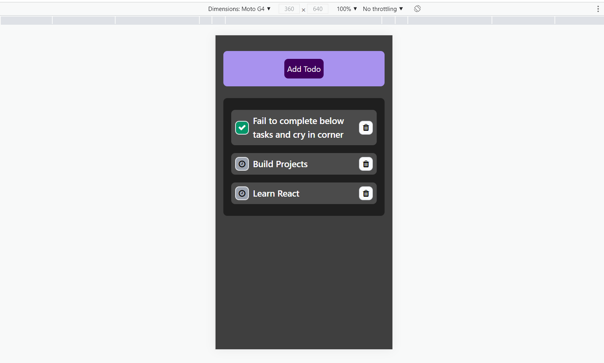
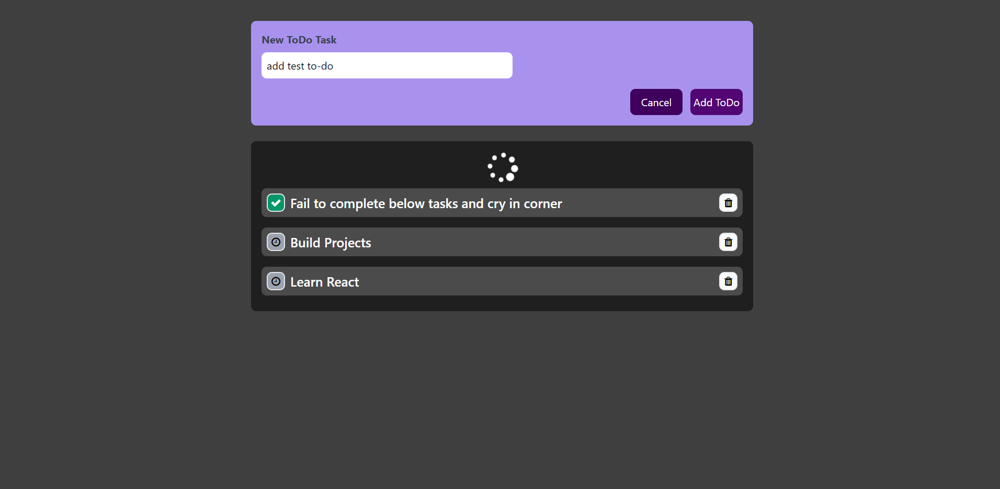
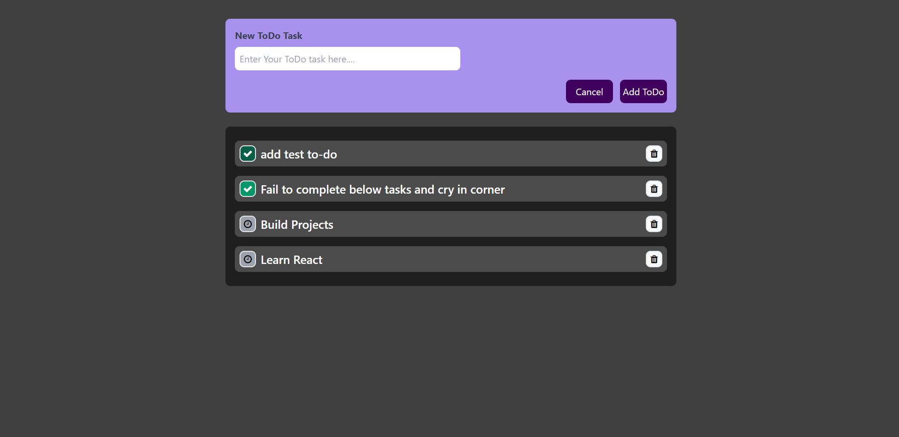

# To-Do App 
### Teck Stack
ReactJS(context API) , Firebase Real Time Database, Tailwind CSS
#
### Functionality 
CRUD Operations

Every time a CRUD operation is performed request is sent to firebase , firebase perform the operation(PUT , POST , DELETE , GET) and send back response and then the data is reflected on frontend

Loading Icon will be visible until we get the response
#
### Responsive

#
### Adding To-Do

#
### Marking To-Do Completed

